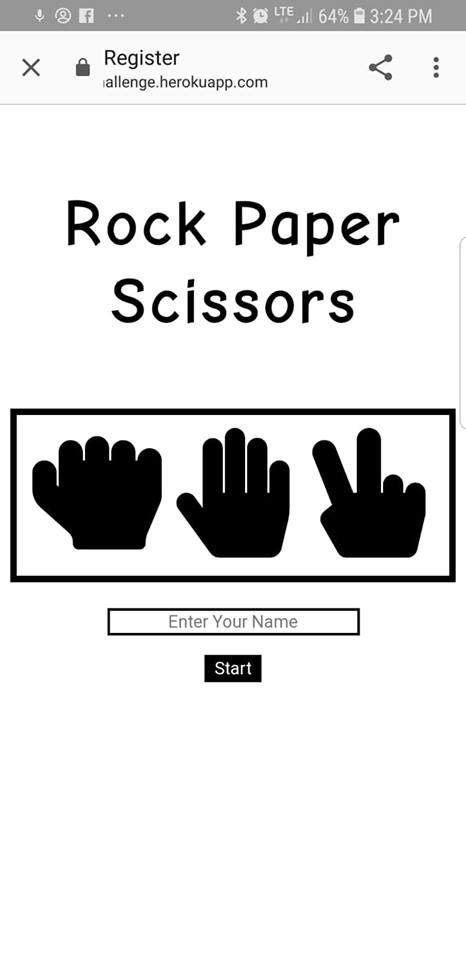
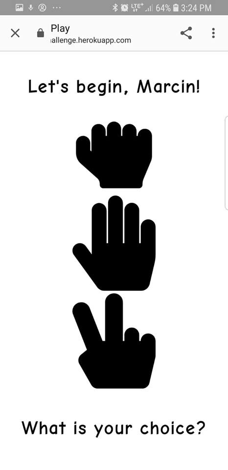
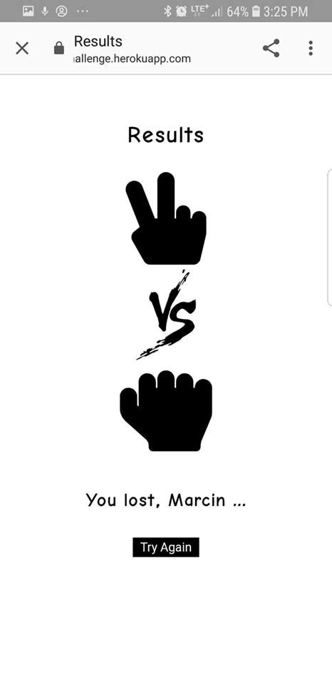

# RPS Challenge #

Building 'Rock Paper Scissors' game following strict TDD. 100% test coverage. Application deployed to Heroku. The app uses Ruby, HTML, CSS, Sinatra and Capybara technologies. Solo project.

The application has been deployed to heroku. You can find a link to it below:

[Click here to check it out!](https://rpschallenge.herokuapp.com/)

-------
**Tools and technologies used to create the game:**

* Ruby / Sinatra
* HTML / CSS
* RSpec & Capybara for testing

Aiming for:

* Complete TDD process ✔
* Cool user interface ✔

-----
**Screenshots of the application:**

-----

1. Registration UI



2. Selecting Rock, Paper or Scissors



3. And the results



-----
Task (please read for general rules and challenge details)
-----

Your task is to provide a _Rock, Paper, Scissors_ game that can be played on the web with the following user stories:

```sh
As a marketeer
So that I can see my name in lights
I would like to register my name before playing an online game

As a marketeer
So that I can enjoy myself away from the daily grind
I would like to be able to play rock/paper/scissors
```

Hints on functionality

- the marketeer should be able to enter their name before the game
- the marketeer will be presented the choices (rock, paper and scissors)
- the marketeer can choose one option
- the game will choose a random option
- a winner will be declared


Please start by

* TEST driving development of your app

## Basic Rules

- Rock beats Scissors
- Scissors beats Paper
- Paper beats Rock

## Additionl Sources

The images used in the application were taken from:

https://fontawesome.com/

https://www.onlinewebfonts.com

